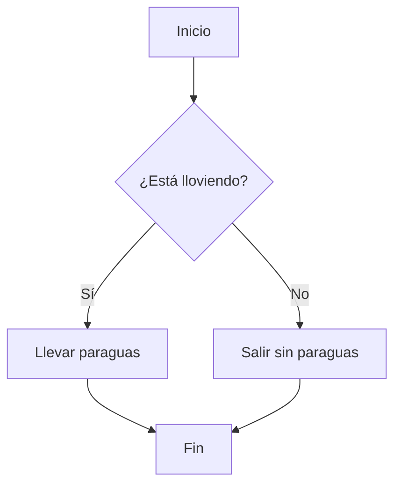

# paquetes

## Introducción a los paquetes en Python

Esta clase trata sobre cómo crear e importar paquetes en Python, practicando Git

```python
print("Hola mundo!)
```

- Lista 1
- Lista 2

## Subtítulo

Más texto

## Diagrama

