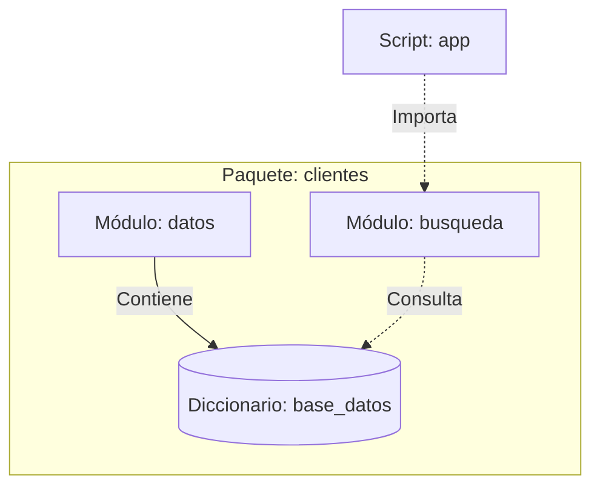
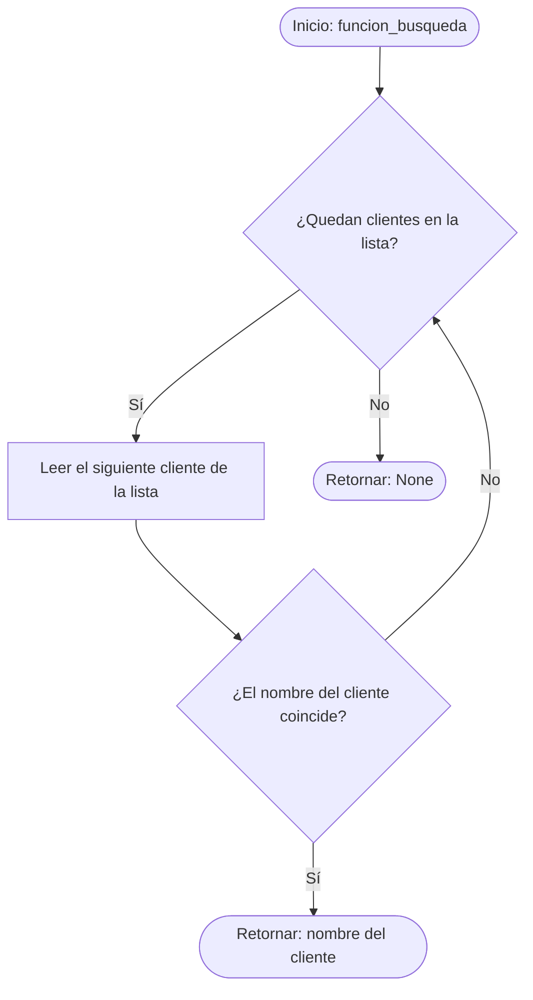
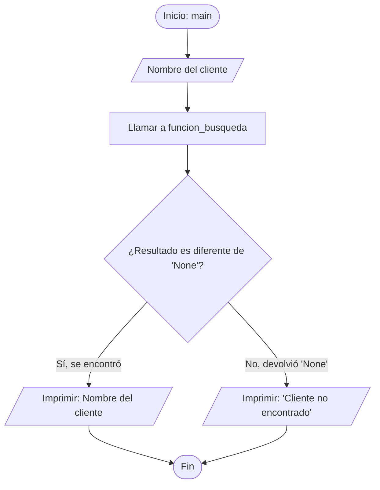

# Consigna de ejercicio

## Paquete  

Crear un paquete llamado `clientes`

## Módulos del paquete

Crear 2 módulos para el paquete:

- **`datos`**: contiene el diccionario variable base_datos

- **`busqueda`**: contiene una función que recibe el nombre de un cliente, itera sobre la lista de clientes, y si el parámetro existe en la lista, entonces devolver el nombre del cliente, de lo contrario devolver None.

## Script principal

Crear un script principal llamado **`app`**. Debe contener importaciones correspondientes. Una función `main()` que pregunte al usuario el nombre de un cliente a buscar. Si el cliente es encontrado, mostrar su nombre, de lo contrario, mostrar "Cliente no encontrado".

## Diagramas

### 1. Estructura del Proyecto (Módulos y Paquete)

Este diagrama muestra cómo se relacionan el script principal, los módulos y los datos dentro del paquete clientes.

### 2. Diagrama de flujo: Función de Búsqueda (Módulo busqueda)

Representa la lógica interna de la función que busca al cliente dentro de la base de datos.

### 3. Diagrama de flujo: Script Principal (Script app - Función main)

Representa la interacción con el usuario y cómo se maneja el resultado devuelto por el módulo de búsqueda.

